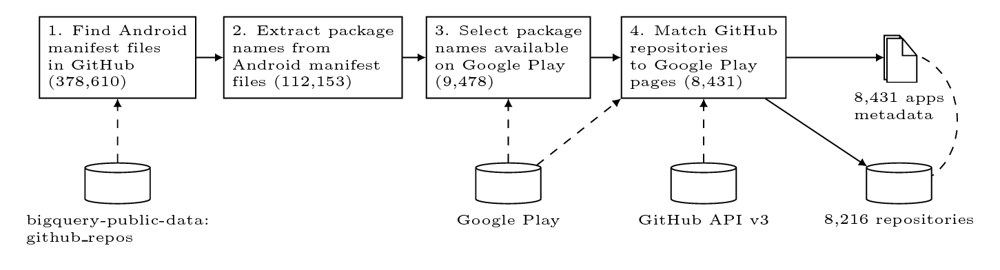

Introduction
============


Here we describe the step-by-step process of creating a dataset of 8,431
open-source Android apps.




Finding Android Manifest Files
------------------------------

```
    SELECT
      repo_name,
      path,
      id
    FROM
      [bigquery-public-data:github_repos.files]
    WHERE
      path LIKE
        '%AndroidManifest.xml'
```

-   From table `github_repos.files`

-   Find all `AndroidManifest.xml` files

-   Store results in table `all_manifest_files`

-   Number of Rows: 378,610

-   Includes many build artifacts, included libraries, …

Extracting Package Names
------------------------

### Step 1: File content

```
    SELECT
      M.id as id,
      M.repo_name as repo_name,
      M.path as path,
      C.content as content
    FROM
      [all_manifest_files] AS M
    JOIN
      [bigquery-public-data:github_repos.contents] AS C
    ON
      M.id = C.id
    WHERE
      NOT C.binary
```

-   From table `github_repos.contents`

-   Retrieve file contents for all previously found files

-   Store results in table `all_manifest_contents`

-   Number of Rows: 378,247

### Step 2: Regular expression

```
    SELECT
      id,
      repo_name,
      path,
      REGEXP_EXTRACT(
        content,
        r'(?is)<manifest[^>]*package=[\'"]([\w\.]*)[\'"]'

      ) AS package
    FROM
      [all_manifest_contents]
    HAVING
      package IS NOT null
```

-   From table `all_manifest_contents`

-   Match `package` attribute

-   Store results in table `all_package_names`

-   Number of Rows: 378,208

### Step 3: Deduplication

```
    SELECT
      package
    FROM
      [all_package_names]
    GROUP BY
      package
```

-   From table `all_package_names`

-   Store results in table `distinct_package_names`

-   Duplicates exist because of libraries, example code, forks.

-   Number of Rows: 112,153

Filtering for Apps on Google Play
---------------------------------

-   Ping canonical Google Play link for each package name:
    `https://play.google.com/store/apps/details?id=<package_name>`

-   HTTP status code `200` is counted as verification for existence on
    Google Play.

-   Number of package names on Google Play: 9,478

-   For 2,191 additional package names status `403 Unauthorized` is returned.

    +   Some are reserved package names (e.g. for Apache
        Cordova library).

    +   Some have been pulled from Google Play.

    +   Some might not be accessible due to geo-blocking. Needs to
        be verified.

    +   Other possible reasons?

-   Some libraries have Google Play pages (e.g. Google Play Services)

Heuristic Matching of Google Play pages to GitHub repositories
--------------------------------------------------------------

With a mapping from package names to repositories from BigQuery and data from
Google Play, we try to match a unique GitHub project to each package name.

```
    SELECT
      package,
      COUNT(repo_name) AS repo_count,
      GROUP_CONCAT(repo_name) AS all_repos
    FROM
      [:manifest_files_in_github.all_package_names]
    WHERE
      package IN (
      SELECT
        package_name
      FROM
        [:manifest_files_in_github.package_names_200] )
    GROUP BY
      package
```

This resulted in the final set of 8,431 open-source Android apps in 8,216
GitHub repositories.
