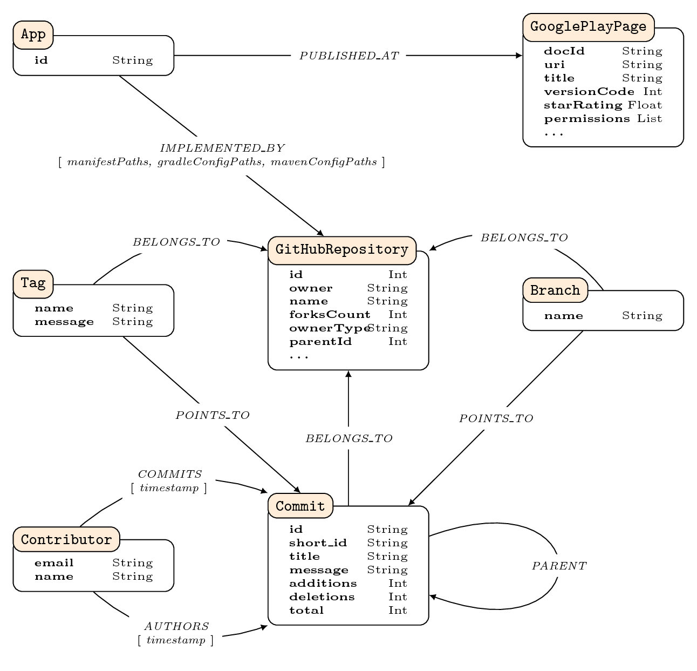

Schema of Neo4j graph database
==============================

Additionally, `FORKS` relationships are introduced between nodes labeled
`GitHubRepository` if an `parentId` or `sourceId` property matches with the
`id` property of another `GitHubRepository` node.

All properties of node `GooglePlayPage
-------------------------------------

Property                   |Type             |Description
---------------------------|-----------------|---------------------------------------------------------------------------------------
docId                      |String           |Identifier of an app, `com.example.app`. This property is always present.
uri                        |String           |The URI of the Google Play page.
snapshotTimestamp          |Int              |POSIX timestamp when metadata from the Google Play entry was stored.
title                      |String           |Title of the app listing.
appCategory                |List of Strings  |A list of categories such as “Tools”.
promotionalDescription     |String           |Short description of the app.
descriptionHtml            |String           |Description of the app in original language.
translatedDescriptionHtml  |String           |Translation of `descriptionHtml` if available.
versionCode                |Int              |Numeric value of the version of the app.
versionString              |String           |Human readable version string.
uploadDate                 |Int              |POSIX timestamp of latest update of app.
formattedAmount            |String           |Price of app (“Free” or “\$1.66”)
currencyCode               |String           |Three character currency code of price (“USD”)
in-app purchases           |String           |Description of in-app purchases (“\$3.19 per item”)
installNotes               |String           |Either “Contains ads” or no value.
starRating                 |Float            |Average review between 0 and 5. May not be available if too few users have rated yet.
numDownloads               |String           |Estimated number of downloads as displayed on Google Play (e.g “10,000+ downloads”).
developerName              |String           |Name of developer.
developerEmail             |String           |Email address of developer.
developerWebsite           |String           |URI of website.
targetSdkVersion           |Int              |Android SDK version the app targets.
permissions                |List of Strings  |List of permission identifiers.

All properties of node `GitHubRepository`
----------------------------------------

Property           |Type    |Description
-------------------|--------|---------------------------------------------------------------------------------------------------------------------------------------------------------------------------
id                 |Int     |Numerical identifier of this repository on GitHub.
owner              |String  |Owner name at snapshot time.
name               |String  |Repository name at snapshot time.
snapshot           |String  |URI to clone of the repository.
snapshotTimestamp  |Int     |POSIX timestamp when snapshot was taken.
description        |String  |Short description of the repository.
createdAt          |Int     |POSIX timestamp when repository has been created.
forksCount         |Int     |Number of forks from this repository created with GitHub’s *fork* functionality. Other ways of forking, cloning locally and pushing to a new repostitory are not counted.
stargazersCount    |Int     |Number of GitHub users having starred this repository.
subscribersCount   |Int     |Number of GitHub subscribers.
watchersCount      |Int     |Number of users watching this repository.
networkCount       |Int     |Number of repositories forked from same source.
ownerType          |String  |Account type of the owner, either “User” or “Organization”.
parentId           |Int     |Id of parent repository if this is a fork, otherwise -1.
sourceId           |Int     |Id of ancestor repository if this is a fork, otherwise -1.

